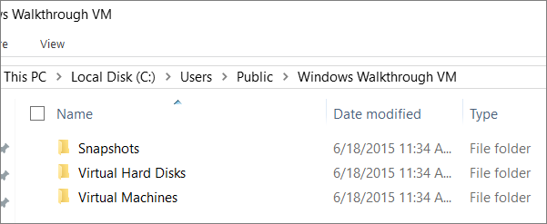

ms.ContentId: B971C429-CEF0-4DAB-8456-3B08AEC0C233
タイトル: 手順 7: エクスポートとインポート、仮想マシン

#手順 7: をエクスポートし、仮想マシンをインポートします。

仮想マシンをコピー、エクスポートを使用して、仮想マシンを移動またはおよびインポート機能を簡単にできます。

##VM をエクスポートします。

仮想マシンをエクスポートすると、すべての部分、チェックポイントなど、VM のエクスポートします。

1. HYPER-V マネージャーでは、仮想マシンを右クリックし、選択 **エクスポート**です。
    
    
2. をクリックして **参照** ] ダイアログ ボックス、C:\Users\Public に移動し、クリックして **フォルダーの選択**です。
    

3.  **バーチャル マシンのエクスポート** ダイアログ ボックスで、パスは正常に見えるかどうかを確認し、クリックして **エクスポート**です。
    
    
4. VM のエクスポート中には、[状態] セクションで進行状況を確認できます。
    
    
    

##エクスポートが動作しましたか。

仮想マシンのエクスポートになっていることを確認するを右クリックし、 **開始** メニューをクリック **ファイル エクスプ ローラー**です。
1. C:\Users\Public\Windows チュートリアルの VM に移動します。
2. 別のフォルダーは、Windows チュートリアルの仮想マシンと呼ばれ、そのフォルダー内の 3 つのフォルダーと、エクスポートされた仮想マシン用ファイルとする必要がありますが表示されます。
 - スナップショット
 - 仮想ハード ディスク
 - 仮想マシン
        
    
    

##VM をインポートします。

私たちは、VM をインポートする前にしようとして、元の VM を削除します。
クリックし、VM を右クリックして **削除**です。

1.  **HYPER-V Manager**, で、 **アクション** ] メニューの [クリックして **仮想マシンのインポート**です。
2.  **[フォルダーの検索** セクションで参照] をクリックし、C:\Users\Public\Windows チュートリアルの VM に移動し、順にクリックして **次**です。
3.  **をインポートする仮想マシンを選択** 画面をクリックして **次**です。
4.  **インポートの種類の選択** セクションで、 **場所に、仮想マシンを登録** 順にクリック **[次へ]**です。
    
6.  **先の選択** セクションで、既定のままにし、クリックして **次**です。
7. 記憶域の選択フォルダーでは、既定のパスをそのまま使用し、クリックして **次**です。
8. [概要] ページでは、新しい仮想マシン ファイルが配置されるパスの一覧が表示されます。
    クリックして **完了** インポートを開始します。

##インポートが動作しましたか。

ために、インポートが動作していたをダブルクリックするだけで、VM **HYPER-V Manager** し、VM をチェックする VMConnect を起動します。

##次の手順:

[手順 8: は、Windows Powershell を使用したテストします。](walkthrough_powershell.md)

